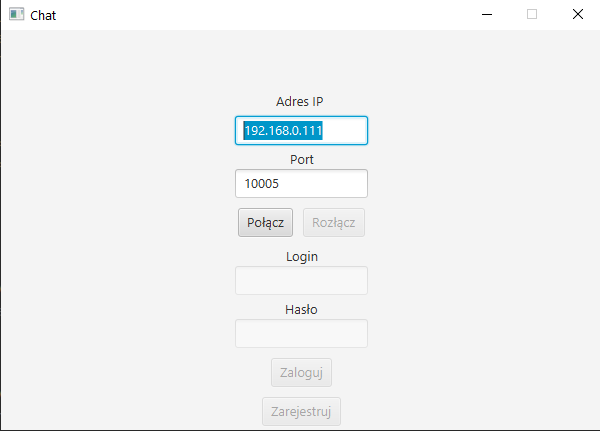
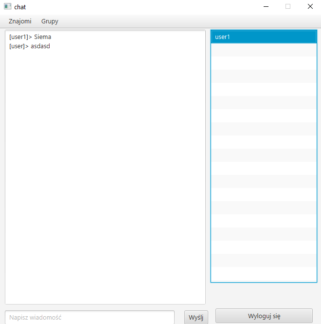
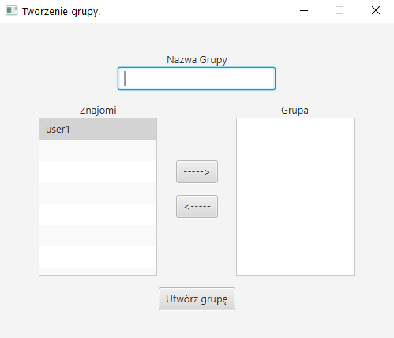

# ChatTCP
> Aplikacja desktopowa napisana w ramach zaliczenia wykładu z przedmiotu Programowanie III. Aplikacja wykorzystując protkół TCP pozwala wielu użytkownikom, na komunikację tekstową. 

## Technologie
* Java 13
* Maven
* JavaFX 14
* MySQL

## Screenshots

## Funkcjonalności
* Rejestracja i logowanie użytkowników
* Wysyłanie i akteptowanie zaproszeń do listy kontaktów
* Wysyłanie wiadomości do osób z listy kontaktów
* Tworzenie grup i zarządzanie nimi
  

